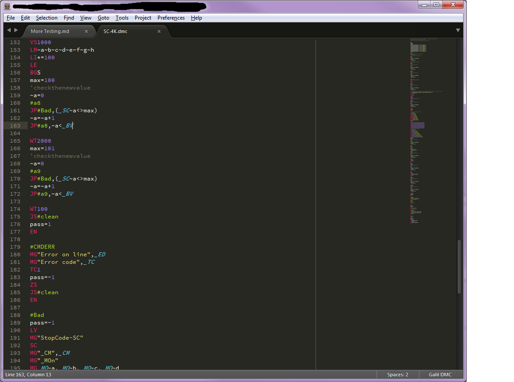

# Galil DMC Syntax Highlighting
This is syntax highlighting in for Galil DMC.

Here is an image of what it looks like with some assembly code.

## Self Install
To install on your own, first download a copy of the whole package. Then in
Sublime Text, go to Preferences then Browse Packages. Copy the entier package
into the User directory.

## Contributing

You can send pull requests via GitHub. Do *not* edit the
`GalilDmc.tmLanguage` file directly. Edit the
`GalilDmc.JSON-tmLanguage` file instead and build the `.tmLanguage` file
from it using the _JSON to Property List_ build tool in
[AAAPackageDev](https://github.com/SublimeText/AAAPackageDev).